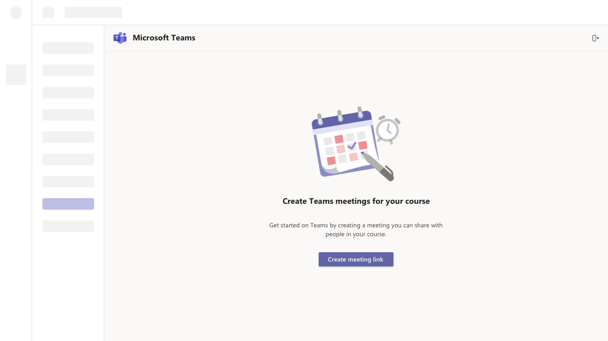

# Microsoft Teams Meetings App for Learning Management Systems (LMS)

<!-- 
Guidelines on README format: https://review.docs.microsoft.com/help/onboard/admin/samples/concepts/readme-template?branch=master

Guidance on onboarding samples to docs.microsoft.com/samples: https://review.docs.microsoft.com/help/onboard/admin/samples/process/onboarding?branch=master

Taxonomies for products and languages: https://review.docs.microsoft.com/new-hope/information-architecture/metadata/taxonomies?branch=master
-->

Welcome to the embeddable Microsoft Teams meeting link creator. With it, Learning Management Systems and app developers can provide an easy way for their users to create Teams meeting links and share them directly with participants. 

The app provides an easy interface where users can:

1) Sign in using their Microsoft account
2) Create a Teams meeting link
3) Copy the meeting information to share within their LMS

Integrating this app template allows you to enable remote learning for your entire userbase by bringing the power of Microsoft Teams' online meetings to your users.

## Contents

| File/folder       | Description                                |
|-------------------|--------------------------------------------|
| `src`             | Sample source code                         |
| `public`          | Static assets                              |
| `deploy`          | Deployment template and scripts            |
| `.gitignore`      | Define what to ignore at commit time       |
| `CONTRIBUTING.md` | Guidelines for contributing to the sample  |
| `README.md`       | This README file                           |
| `LICENSE`         | The license for the sample                 |

## Prerequisites

This is a single page web app and requires only static web hosting to deploy the service.

We recommend hosting on your own app platform or service, creating an Azure storage account, or integrating the code directly into your own experience.

## Setup

### Register an Azure AD application

You'll need to register an app through the following process:

1. Sign in to the [Azure portal](https://go.microsoft.com/fwlink/?linkid=2083908) using either a work or school account or a personal Microsoft account.
2. If your account gives you access to more than one tenant, select your account in the top right corner, and set your portal session to the Azure AD tenant that you want.
3. Select **New registration**.
4. When the Register an application page appears, enter your application's registration information:
   * **Name** - Enter a meaningful application name that will be displayed to users of the app.
   * **Supported account types** - Select which accounts you would like your application to support.
5. When finished, select **Register**.
6. Azure AD assigns a unique application (client) ID to your app, and you're taken to your application's Overview page.

    Copy the Application Id. This is the unique identifier for your app.

7. Under **Manage** on the left-hand pane, click **Authentication**. Under **Redirect URIs**, click **Add URI** and enter the following URIs:
    * `http://localhost:3000/`

    On the same page, under **Implicit grant**, make sure that both **Access tokens** and **ID tokens** checkboxes are checked.

    Click **Save** to save your changes.

7. Under **Manage** on the left-hand pane, click **API permissions** and then **Add a new permission**. Select **Microsoft Graph** and then **Delegated permissions**. Add the `OnlineMeetings.ReadWrite` (Read and create user's online meetings) permission.

### Update the configuration

Change the following values in the `msalApp.ts` file:
* **clientId** - Set this to the Application (client) ID of the AAD application that you registered

## Available Scripts

In the project directory, you can run:

### `yarn install`

Installs all the dependencies for the app.

### `yarn start`

Runs the app in the development mode. 
Open [http://localhost:3000](http://localhost:3000) to view it in the browser.

The page will reload if you make edits. 
You will also see any lint errors in the console.

### `yarn build`

Builds the app for production to the `build` folder. 
It correctly bundles React in production mode and optimizes the build for the best performance.

The build is minified and the filenames include the hashes. 
Your app is ready to be deployed!

See the section about [deployment](https://facebook.github.io/create-react-app/docs/deployment) for more information.

### `yarn eject`

**Note: this is a one-way operation. Once you eject, you can’t go back!**

If you aren’t satisfied with the build tool and configuration choices, you can eject at any time. This command will remove the single build dependency from your project. 

Instead, it will copy all the configuration files and the transitive dependencies (webpack, Babel, ESLint, etc) right into your project so you have full control over them. All of the commands except eject will still work, but they will point to the copied scripts so you can tweak them. At this point you’re on your own. 

You don’t have to ever use eject. The curated feature set is suitable for small and middle deployments, and you shouldn’t feel obligated to use this feature. However we understand that this tool wouldn’t be useful if you couldn’t customize it when you are ready for it. 

## Learn More
You can learn more in the [Create React App documentation](https://create-react-app.dev/docs/getting-started/). 

To learn React, check out the [React documentation](https://reactjs.org/). 

## Frequently Asked Questions

### Does the meeting scheduler need to have a Teams? 
Meeting schedulers need to have a Microsoft Teams license. They need to be able to authenticate into the experience using the Microsoft account given to them by their school or work. Teams IT administrators also need to grant the scheduler with the ability to schedule meetings through [Teams policies](https://docs.microsoft.com/en-us/microsoftteams/meeting-policies-in-teams).

### Do you need Teams to join the meeting?
If [anonymous join has been enabled](https://docs.microsoft.com/en-us/microsoftteams/meeting-settings-in-teams) within the scheduler’s Teams tenant, users do not need a license to join a meeting. Meetings created through this application respect all Teams [policies](https://docs.microsoft.com/en-us/microsoftteams/meeting-policies-in-teams), [settings](https://docs.microsoft.com/en-us/microsoftteams/meeting-settings-in-teams) and [options](https://support.office.com/en-us/article/roles-in-a-teams-meeting-c16fa7d0-1666-4dde-8686-0a0bfe16e019) applied by the scheduler and their IT administrator. Teams meetings can be joined over the web or any Teams client.

### Where can I learn more about the Teams meeting experience?
Users 
- [Getting started with Teams meetings](https://support.office.com/en-us/article/meetings-and-calls-d92432d5-dd0f-4d17-8f69-06096b6b48a8?ui=en-US&rs=en-US&ad=US#ID0EAABAAA=Meetings)
- [Conduct meetings with Microsoft Teams](https://www.youtube.com/watch?reload=9&v=63cMG0fBRLM)
- [Change who can present in a meeting](https://support.office.com/en-us/article/roles-in-a-teams-meeting-c16fa7d0-1666-4dde-8686-0a0bfe16e019)

Admins 
- [Getting started with remote learning](https://docs.microsoft.com/en-us/MicrosoftTeams/remote-learning-edu)
- [Manage Teams meeting policies](https://docs.microsoft.com/en-us/microsoftteams/meeting-policies-in-teams)
- [Manage Teams meeting settings](https://docs.microsoft.com/en-us/microsoftteams/meeting-settings-in-teams)

### Do meetings that I schedule through this integration appear in my Outlook or Teams calendars?
No, meetings scheduled through the app do not appear in the scheduler’s Outlook or Teams calendar.

### When will my Teams meeting expire?

Meetings scheduled through the application are regular meetings and following [normal Teams meeting expiration timelines](https://docs.microsoft.com/en-us/microsoftteams/limits-specifications-teams) based on the date you enter when you create the meeting.

### What languages do you support?

The scheduling app supports all the [languages supported by Teams for Education](https://support.microsoft.com/en-us/office/change-your-display-language-in-microsoft-teams-293792c3-352e-4b24-9fc2-4c28b5de2db8?ui=en-us&rs=en-us&ad=us).

## Feedback

Thoughts? Questions? Ideas? Share them with us on [Teams UserVoice](https://microsoftteams.uservoice.com/forums/555103-public)!

Please report bugs and other code issues [here](https://github.com/OfficeDev/msteams-app-lms-meetings/issues/new).

## Legal notice

Please read the license terms applicable to this app template [here](https://github.com/OfficeDev/msteams-app-lms-meetings/blob/master/LICENSE). In addition to these terms, by using this app template you agree to the following:

* You are responsible for complying with applicable privacy and security regulations related to use, collection and handling of any personal data by your app.  This includes complying with all internal privacy and security policies of your organization if your app is developed to be sideloaded internally within your organization.

* Microsoft will have no access to data collected through your app.  Microsoft will not be responsible for any data related incidents or data subject requests.

* Any trademarks or registered trademarks of Microsoft in the United States and/or other countries and logos included in this repository are the property of Microsoft, and the license for this project does not grant you rights to use any Microsoft names, logos or trademarks outside of this repository.  Microsoft’s general trademark guidelines can be found [here](https://www.microsoft.com/en-us/legal/intellectualproperty/trademarks/usage/general.aspx)

## Contributing

This project welcomes contributions and suggestions.  Most contributions require you to agree to a
Contributor License Agreement (CLA) declaring that you have the right to, and actually do, grant us
the rights to use your contribution. For details, visit https://cla.opensource.microsoft.com.

When you submit a pull request, a CLA bot will automatically determine whether you need to provide
a CLA and decorate the PR appropriately (e.g., status check, comment). Simply follow the instructions
provided by the bot. You will only need to do this once across all repos using our CLA.

This project has adopted the [Microsoft Open Source Code of Conduct](https://opensource.microsoft.com/codeofconduct/).
For more information see the [Code of Conduct FAQ](https://opensource.microsoft.com/codeofconduct/faq/) or
contact [opencode@microsoft.com](mailto:opencode@microsoft.com) with any additional questions or comments.

